# Microservices Architecture

## Reference Documentation

This review of concepts is a summary for the section dealing with Scaling Our Microservices Architecture of Dimos Raptis's course on Udemy.

This is based primarily on the reference below:

* [Microservices Architecture](https://www.udemy.com/course/microservices-architecture/)

## Features

These are the key features that we'll cover in this review:

- Scaling and Load Balancing

- Service Discovery

- Service Mesh versus API Gateway

## Scaling Our Microservices Architecture

In this section, we will see what are the basic principles we should follow to create systems that are scalable and can adapt to increasing traffic patterns.

We'll also see some of the common problems that services have to solve and how some approaches can help us leverage their use between all our services.

We'll see how a microservices architecture facilitates scaling of systems and why minimizing the sharing of resources between systems can make scaling much easier.

We will then discuss a related concept that is Service Discovery. We'll explain what are some of the complications around communication between services as the number of services grows in our architecture, what are the alternative options we have and what are the pros and cons of each one.

In the last part, we'll explain what the Service Mesh and an API Gateway is, what are the problems they solve and where each approach is more suitable.

## Scaling and Load Balancing

In this first part, we'll explore how we can make our systems more scalable, so that our architecture can easily cope with gradual and sudden increases in traffic.

### Independent Scaling

A major benefit from the microservices architecture when compared to a monolithic model is the ability to scale our various systems independently.

We'll try to illustrate what that means through an example. 

In a monolithical system, we would have multiple components for each one of our business capabilities, all of them deployed as a single service.

This means that if for instance, a very popular song got published and we see increased traffic from customers searching for this song, we would need to scale our catalog and discovery components.

However, since everything is deployed as a single unit, deploying more units of our service means that the other components would be underutilized.

To overcome these limitations, we would split our monolith into different services, one for each business capabilities. In this way, we would be able to scale independently only the parts of the architecture that face increased demand.

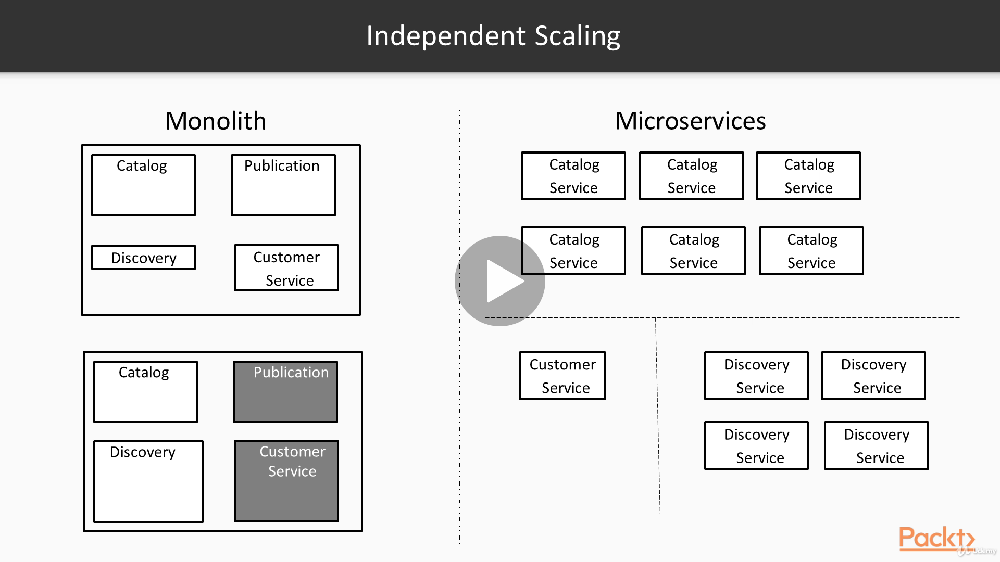

Independent Scaling, by Dimos Raptis, [Udemy](https://www.udemy.com/course/microservices-architecture/).

### Scaling Modes

As we'll see here, there are two main approaches of scaling a system: vertical scaling and horizontal scaling. 

Vertical scaling is when we make a system capable of handling more work by adding resources like increasing the memory available or the number of processors. For instance, we could start with a single server for our service, having a single core and 2 GB of memory.

When our traffic increases, we can replace it with a more powerful server, having 8 cores and 16 GB of memory.

We can keep doing that as our traffic keeps increasing.

There are three main problems with this kind of scaling.

First of all, because of physical limitations, there is a limit over which we won't be able to scale our systems further, following this approach.

Secondly, this approach is very costly, since costs increase exponentially as we move to more and more powerful servers.

And lastly, we have a Single Point Of Failure (SPOF), which means that if something happens to our single machine, we won't be able to serve a single customer.

A second approach is Horizontal Scaling, where we make our system capable of handling more work by connecting more instances of the same limited capacity.

For instance, we can start with a single server of 1 core and 2 GB of memory and as our traffic grows, we can start adding more servers of the same type to our fleet.

As we can imagine, theoretically, this approach should be able to scale infinitely by adding more and more servers.

In practice, there might be other limitations that make infinite scaling non-feasible, but still this approach has much greater potential than the vertical scaling.

Furthermore, having many of these cheap commodity servers is usually less expensive than having a single high end server and much more reliable.

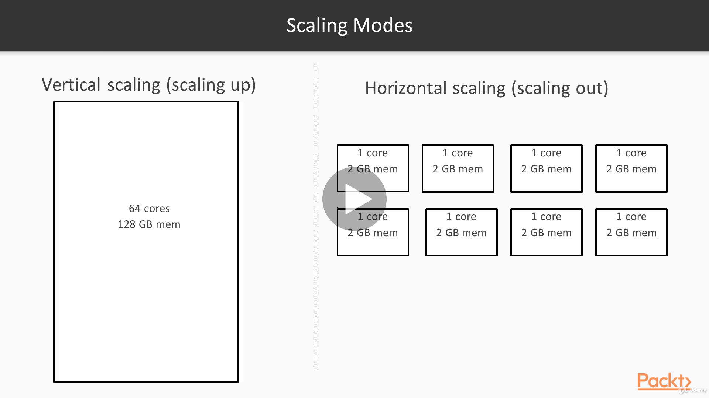

Scaling Modes, by Dimos Raptis, [Udemy](https://www.udemy.com/course/microservices-architecture/).

### Shared-Nothing Architectures

The key takeaways from the previous slide is that horizontal scaling is preferable to vertical scaling in general.

However, we mentioned previously that there can be some practical limitations for horizontal scaling as well.

So we'll try to elaborate on this now.

Let's say we have a service consisting of 2 servers and the Relational Database.

Our customer base grows and so does the traffic to our servers.

As we explained previously, we increase the number of servers to scale our service.

As a result of this, the request from our users are now split between more servers, so our service can cope with increased load.

However, as we can see, all the servers enp up using our single database, which is obviously a bottleneck.

So, after a point, we'll realize that increasing the number of servers does not increase our capacity, because we raised the limit of our database.

There are several approaches to mitigate this, such as using the approach of vertical scaling or using a master/slave approach, where applications write to a database instance, but can read from multiple ones.

However, in most of these approaches, the servers have to share a single component. For example, even in the master/slave scenario, all servers must write to the same master node. This sharing limits the ability of our system to scale horizontally.

In order to leverage horizontal scaling, we'll have to keep our architecture from having a single connection across the whole system, what is usually called a `Single Point Of Failure` (SPOF).

This kind of architecture is usually called a Shared-Nothing Architecture.

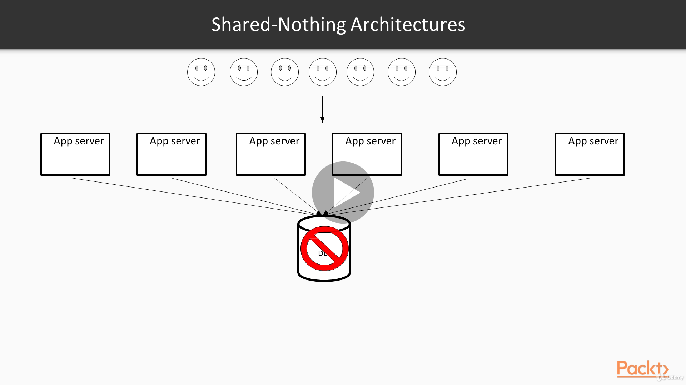

Shared-Nothing Architecture, by Dimos Raptis, [Udemy](https://www.udemy.com/course/microservices-architecture/).

Looking back at our example, in order to achieve that for our database, we would have to split our dataset across several servers, a technique called Sharding, or Partitioning.

By doing that, no matter how many data we would have to store, we could just add more servers to our database fleet, increasing our capacity.

On top of that, requests from the application servers would now be distributed among all these servers, depending on which data they access.

This is a practice followed by several Distributed Data Stores, such as DynamoDB or Cassandra.

However, as everything in software, this comes with its own trade-offs. For instance, distributing our data across servers means that executing transactions or performing queries that join datasets becomes more inefficient.

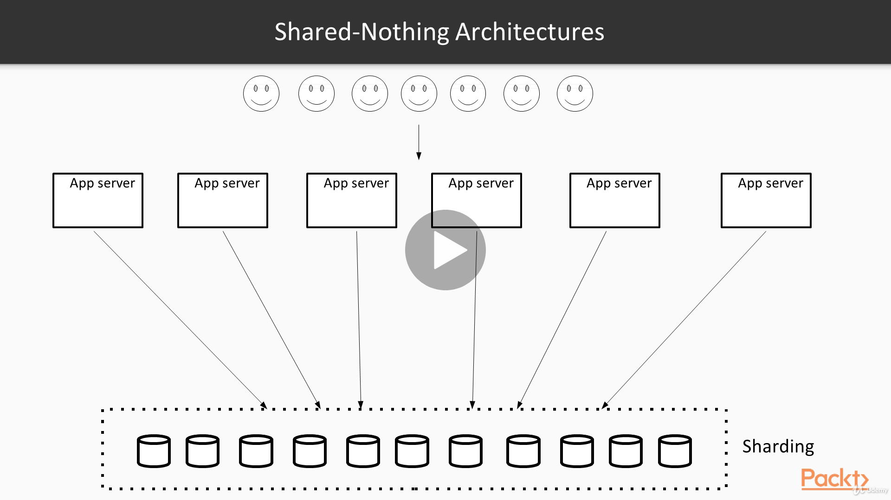

Sharding, by Dimos Raptis, [Udemy](https://www.udemy.com/course/microservices-architecture/).

Assuming that we've already decided to scale horizontally our servers having a fleet of servers, we'll still have to find a way to distribute the incoming requests among our application servers.

### Load Balancing

`This effort to distribute the requests between servers as equally as possible so that we can utilize all of them is called Load Balancing.`

The Load Balancer is the component that will receive the request by the customers, select one of the application servers to forward the request to, collect the response and pass it through to the client.

Next request comes in and the Load Balancer will probably pick a different application server this time.

There are different algorithms for choosing which server to send the request to.

Of course, in the same spirit of our discussion so far, it is important to make sure that these Load Balancer does not become a `Single Point Of Failure` (SPOF).

Also we should remember that the traffic will probably be so big as to require multiple application servers to handle it, so a single Load Balancer server might not be enough to cope with it.

Implementing that is a serious undertaking, but cloud providers have services for Load Balancing that are under the hood composed of multiple servers, which means that they can handle very high load and are resilient to failures of a single server.

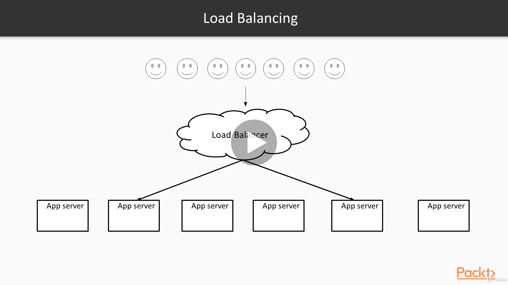

Load Balancing, by Dimos Raptis, [Udemy](https://www.udemy.com/course/microservices-architecture/).

#### Auto Scaling

In the beginning of this course, we discussed the contribution cloud computing had in the adoption of the microservices architecture.

`Auto Scaling is a method enabled by cloud computing whereby the resources of a service are automatically adjusted depending on the current load.`

In order to understand what benefits auto scaling brings we'll have a look at the processes followed before the rise of cloud computing.

Before cloud computing, buying a server was a process much more tedious and time consuming. As a result, teams were observing the traffic of their services through time, calculating the number of servers they would need to be able to handle the peak traffic.

This was a process calle `Capacity Plan`.

However, that meant that when traffic was lower than the peak during the year, most of the servers would be under utilized. So, they were essentially wasting money. This approach had another pitfall. As we said, engineers were calculating their capacity based on traffic trends so far. However, sometimes, unexpected things happen. This means that if traffic rise past expectations, their service would not be able to cope with it and would start failing requests.

What people sometimes did to avoid this is adding more headroom when making their calculations to account for these unexpected events.

Of course this meant that they were wasting either more money in order to be saved instead of being sorry.

The advent of cloud computing made provisioning of a server a much quicker process though. People are now able to have an additional server in a matter of minutes if not seconds.

As a result, they can provision just as many servers as needed to handle the current traffic, release them when traffic goes down, and provision them again when traffic goes up.

Auto Scaling is a mechanism that allows systems to do that automatically based on several conditions that can be defined.

So, Auto Scaling enables applications to be much more cost efficient and resilient.

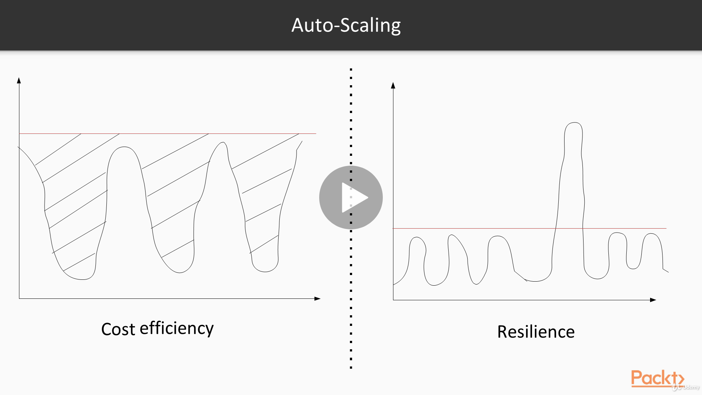

Auto Scaling, by Dimos Raptis, [Udemy](https://www.udemy.com/course/microservices-architecture/).

# Service Discovery

In this section, we will explore one of the problems we have to solve when our microservices architecture has grown, called Service Discovery, and go over some of the solutions that are available.

First of all, we need to explain what Service Discovery is and why it is a major requirement in a microservices architecture.

## The Need for Service Discovery

`Service Discovery is the ability to find where a service is located and how we can access it.`

Of course, in a monolithical system, consisting of a single server, this is a trivial problem to solve.

If our system is called by other systems, we can use the IP of the server.

Alternatively, if real humans are using directly the server, we could use its domain name. 

However, in a microservices architecture, this becomes a problem of a much larger scale, and it is not that easy to solve.

First of all, each service needs to know the location of each other service that it needs to go. On top of that, each service now has a cluster of multiple servers, so this discovery should include the location of all of them.

As if that was not complex enough as we saw previously, resources in a microservices architecture change dynamically, so that discovery should be capable of identifying the addition of new servers or removals of old servers.

And we are currently looking at only a single dimension, since as we described previously, we'll probably need to have multiple stages, such as Development, Staging, Production, etc.

So, it is now clear that it's imperative to have a solution for an automated Service Discovery if we want our microservices architecture to be successful.

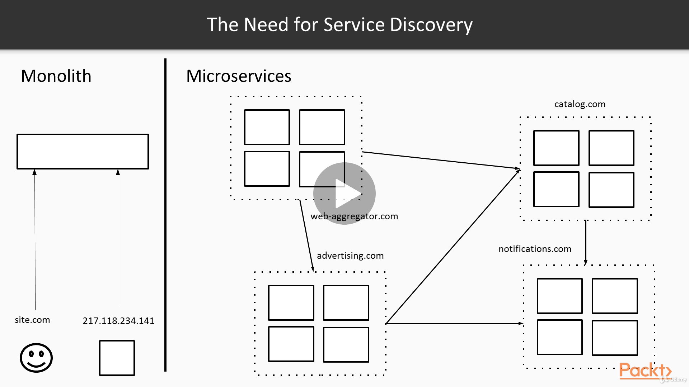

The Need for Service Discovery, by Dimos Raptis, [Udemy](https://www.udemy.com/course/microservices-architecture/).

### What Service Discovery Is

Before looking at the solutions, we'll first summarize the key requirements and the things we have to take into account.

- Key parts of Service Discovery

	- A way to find the access point of another service

	- A way to publish the access point of our service

	- A way to register/deregister new access points for our service

First of all, as we mentioned, we need a way to find how we can access other services and let other services find how they can access our service.

As we mentioned previously, we also need a way to dynamically update these access points in an easy way.

- Important considerations:

	- Reactive to changes

	- Extensible to multiple environments

	- Interoperable with existing technology standards

	- Ability to load balance by default

Some secondary but stil very important considerations are the following. This discovery should be able to identify changes easily.

As we've explained previously, our CI/CD pipeline will consist of multiple stages, so there should be an easy way to select a specific stage of a service easily.

Of course a solution that integrates easily with existing technology standards will be much easier to adopt.

Our service will consist of multiple servers, so ideally Load Balancing should also be performed as part of the Service Discovery.

- Two major approaches:

	- Server-Side Service Discovery

	- Client-Side Service Discovery

We'll see that there are two main approaches for Service Discovery: either Server-Side or Client-Side Service Discovery.

Let's see first what Server Side Discovery looks like.

### Server-Side Service Discovery

On the right side we have all the servers of a Service B listening to requests.

On the left side, we have a client of Service A which needs to make a request to Service B. 

In between we have a component that acts as the router of Service B. It receives requests from other services on behalf of Service B, forwards them to the servers and hands back the response to each request to the clients.

This component is responsible for keeping track of the instances of the front end Service and load balancing the traffic between all the servers.

To see an example, an incoming request for Service B will go through the router, which will forward it to an instance.

When a new server of Service B comes up, it will register itself with the router.

In this way, the router will be able to send subsequent requests to this server as well.

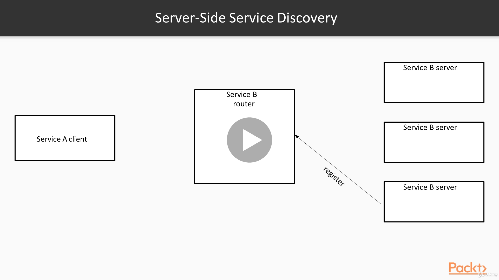

Server-Side Service Discovery, by Dimos Raptis, [Udemy](https://www.udemy.com/course/microservices-architecture/).

Let's see an example of Server-Side Discovery can be implemented in practice.

### Server-Side Service Discovery (Example)

Load Balancers are widely used as the routing component we described previously.

There are many open source load balancers available.

However, there is additional configuration work required to set them up in a highly available mode.

Cloud Providers provide load balancers as a service, which are by default highly available.

So, we'll use one of these services in our example. We'll use an AWS service called Elastic Load Balancing (ELB).

The way this works is that ELB provides a single domain that acts as the access point of our service.

We'll have to register instances with the ELB and then it will be able to forward the incoming requests to the registered instances.

To automate this registration process, we'll use AWS Auto Scaling, which will be responsible for adjusting dynamically the resources of our service and the registration of the servers with an ELB.

In this way, when new servers are started, Auto Scaling will register them automatically. 

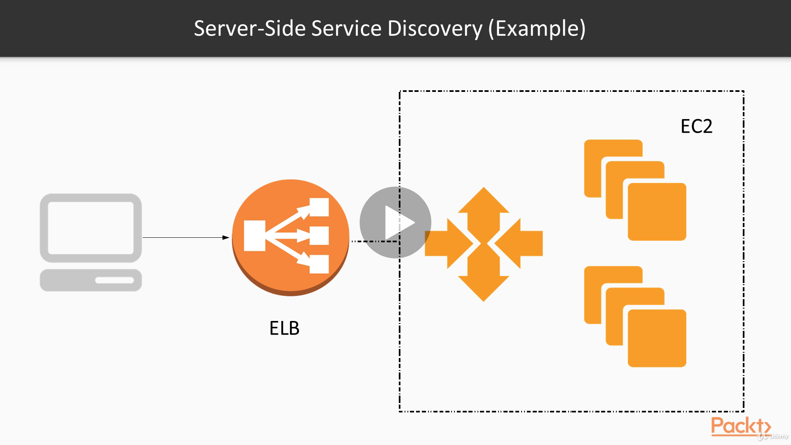

Server-Side Service Discovery (Example), by Dimos Raptis, [Udemy](https://www.udemy.com/course/microservices-architecture/).

### Client-Side Service Discovery

Let's have a look at the Client-Side Discovery now.

In this approach, we have a central Service Registry, which is responsible for holding the access points of all our microservices.

In this way, before a request, Service A has to query this Registry to find the access point of Service B.

The Registry will respond with the IPs of some of the servers.

The client will then pick one of them and make the request directly to the server.

In the same logic, when a new server comes up, it will add itself in the Registry.

On the next request, the Registry will include this new IP in the response, and Service A will start using the new server as well.

There are many open source tools available that can be used as Service Registry, such as Zookeeper, Console, and etcd.

The core pattern we'll illustrate here looks very similar to the Server-Side Discovery, but there are some practical differences we omitted for simplicity.

For instance, the Service Discovery can be performed periodically in an asynchronous way from the client to improve performance and make the system more resilient to failures.

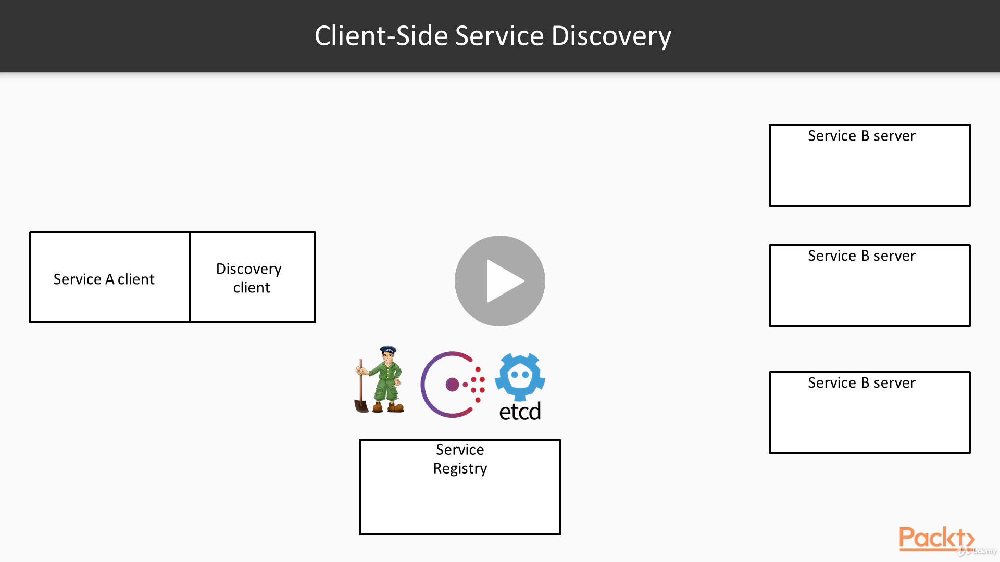

Client-Side Service Discovery (Example), by Dimos Raptis, [Udemy](https://www.udemy.com/course/microservices-architecture/).

### Pros and Cons

Now that we've seen both approaches, we'll spend some time looking at the pros and cons of each one.

This can guide us when deciding which approach is better for our architecture.

#### Server-Side Service Discovery

		+ The client code is simpler since it doesn't have to do discovery

		+ Most Cloud Providers have load balancing offerings, which solve the problem with minimal complexity

		+ Service Discovery and Load Balancing are centralised outside our service

		- One more moving part in our architecture

		- More network hops

		- Some implementations can be tricky, for example, DNS

Starting with a Server-Side approach, the client code is usually a lot simpler, since it does not perform any Service Discovery or Load Balancing at all. It just uses a central point of access.

Another big plus is that most of the cloud providers have load balancing services which are very easy to set up, use and operate.

On top of that, these companies have significant expertise in operating large scale systems. So, we are usually much better off relying on them for operating the systems instead of operating everything ourselves.

Last but not least, this approach provides a centralized place for service discovery and load balancing decouple from the services.

On the negative side, this approach adds one more moving part in our architecture. 

It also means that requests will have to do one more network call to reach the service, leading to higher latency.

One more thing to keep in mind is that implementation is based on DNS are tricky, because domain names are cashed in many places, including web browsers, which can lead to problematic situations.

For instance, it can lead to a situation where customers keep using addresses of services that have been decommissioned.

### Client-Side Service Discovery

		+ More efficient, fewer network hops

		+ Can help achieve consistency when provided as a library

		- Can couple the client to the technology of the service registry

		- Setting up a service registry requires more work than setting up a plain load balancer

On the other side, as we saw, the Client-Side approach is more efficient, having fewer network hops, since the Service Discovery can be done asychronously.

It can also help achieve consistency in our architecture by having a shared library used by all our services.

However, this approach can couple our architecture to specific technologies, while the Server-Side approach uses more standard technologies, such as HTTP and DNS.

Also, as we mentioned before, setting up and operating a Service Registry is a much more complex task when compared to a load balancer.

# Service Mesh versus API Gateway

In this section, we will explore some problems that are common in a microservice architecture, and compare the two major approaches of tackling them: the Service Mesh and the API Gateway.

## Common Concerns

When we are operating in a microservices architecture, there is a set of problems that are quite generic and have to be solved for every single service we might have, regardless of the corresponding business logic.

For this reason, we sometimes call these concerns crosscutting.

- Monitoring

- Resilience patterns (example: timeouts) on-the-fly transformations

- Rate limiting and quotas

- Authentication/Authorization SDK generation

- API keys for 3rd party developers

Some of these problems are:

- How we can monitor our services in a consistent way?

- How we can make our services more resilient to failures?

- How we can apply transformations such as adding some custom http headers to the request?

- How we can perform rate limiting on some endpoints or even set up custom quotas per customer?

In the case of internal service-to-service communication, we'll also need a way to authenticate and authorize these calls.

If we need to make our software consumable externally, we'll also need a way to generate SDKs and then API keys to third party developers.

As we mentioned previously, these concerns tend to be common for a lot of services, so it makes sense to have a common way of tackling them to prevent duplication across different services.

The main approach is that we'll visit in this section are the API Gateway and the Service Mesh.

### API Gateway

The API Gateway is essentially a central component where the functionality for all these things is centralized.

All the requests for a service will first pass through the API Gateway, which will be responsible for authenticating the requests, apply any quotas and billing to the customer and any other operation that is enabled.

After all of that is completed, the request will be dispatched to the service to be handled.

In the same way, the response from the Service will be bussed again to the API Gateway, which might for instance add some HTTP headers to the response and meet some metrics for the results, etc.

Reflecting back to our previous examples, we will probably realize that the concept of the API Gateway is very close to that of a Load Balancer.

An API Gateway can be implemented using a single proxy web server. However, there are a lot of comercial offerings from Cloud Providers, which provide an extensive feature set, including most if not all of the functionality we discussed previously.

Using one of these offerings can simplify a lot our architecture and help us deliver software faster with less work.

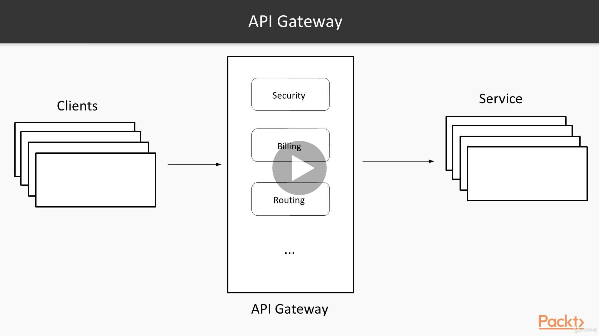

API Gateway, by Dimos Raptis, [Udemy](https://www.udemy.com/course/microservices-architecture/).

### Service Mesh

On the other hand, the Service Mesh takes a different approach, descentralizing this functionality to each server.

In this approach, each instance of a service consists of two processes: one process running the application itself and another process which is responsible for executing all the additional functionalities.

This pattern is usually called Sidecar, because it resembles a sidecar attached to a motorcycle.

The sidecar process has exactly the same lifecycle with a process running the application.

It is created and retired together with this process and provides all the supporting features. Usually, the logic of the sidecar process is common for all the services and is reused as a shared library.

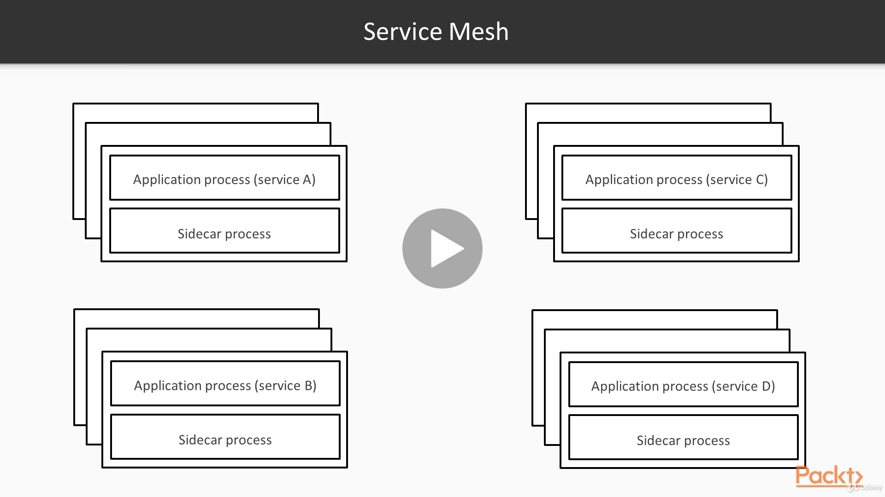

Service Mesh, by Dimos Raptis, [Udemy](https://www.udemy.com/course/microservices-architecture/).

To understand better how the Service Mesh approach works, let's look at a simple diagram of the interaction between two services: A and B.

Service A creates a request for Service B. This request will first go through the sidecar process of Service A, which will act as a proxy. The sidecar process will be responsible for performing all the required operations.

For instance, if encryption is enabled, the sidecar process will be responsible for encrypting the request before sending it.

On the other side, the request will first be passed through the sidecar process of Service B, which will decrypt it.

It will also perform any other required operations, such as checking the quota of Service A, and rejecting the request if it has crossed the current threshold.

After all the operations of the sidecar have been completed, the request will be passed through the application process of service B, which will process it regularly.

Of course the response from Service B will also pass through the sidecar processes in the same way.

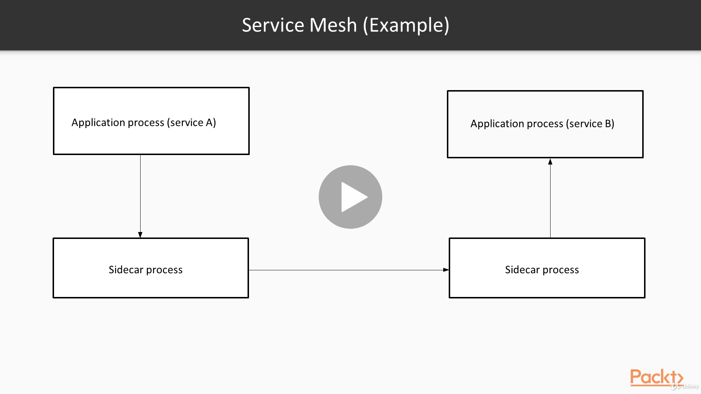

Service Mesh (Example), by Dimos Raptis, [Udemy](https://www.udemy.com/course/microservices-architecture/).

### Pros and Cons

#### API Gateway

Now that we've seen both approaches, we'll spend some time looking at the pros and cons of each one.

		+ Interoperable with standard technologies (for example, HTTP)

		+ Centralizes all the cross-cutting concerns

		- Introduces an additional network hop

		* More suitable for externally consumed APIs

The API Gateway is usually relying on standard web technologies, such as HTTP.

This means that it's easier to integrate and creates less coupling.

It also allows us to centralize all the cross-cutting concerns in a central place which makes operation and troubleshooting easier.

However, it introduces an additional network hop with related performance implications.

As a result, this approach is a better fit for API of services that are consumable externally, perhaps from third party developers.

#### Service Mesh

		+ Reduces code duplication

		+ Improves consistency

		+ Very efficient

		- Additional complexity since functionality becomes transparent

		- Creates coupling with the Mesh's shared library

		* More suitable for internal service-to-service communication

The Service Mesh as we have seen reduces code duplication and improves consistency for our architecture, since all the services will have a single way of performing all these operations.

It's also very efficent, since the sidecar process is located on the same machine, which means that there is no additional network hop required.

On the negative side, it introduces significant complexity, since a lot of things are now done transparently by a secondary process without our knowledge.

It also creates some coupling, since any software that needs to use our services we'll need to make use of this shared library from now on.

In the worst case, if these libraries are not encapsulated correctly, this would even limit our choice in programming languages we can use.

Because of that, the Service Mesh approach is usually a better fit for the Service-to-Service communication of our internal microservices architecture.

